# DatingProfilesClassification
ML - решение для прогнозирования "лайков/дизлайков" анкеты на сайте знакомств по предпочтениям конкретного одного пользователя.
## Порядок действий:
1. Испольуя модуль ```telethon``` и ```asynio``` было получено 22000 анкет разных девушек. В анкете содержались фотографии, имя, возраст, описание анкеты и лайк/дизлайк от конкретного пользователя.
2. Были выделены признаки для обучения (подробно об этом чуть ниже)
3. На данных обучено 2 модели: XGBoost и RandomForest. Для них подобраны гиперпараметры.
4. Проведён эксперимент: в режиме реального времени "пролайканы" около 300 анкет, после чего для них выделены соответствующие признаки и сделан предикт.
5. Приведены выводы по данному ML - решению.

## Описание файлов:
- в папке ```./models``` находятся обученные модели (но они добавлены в gitignore).
- в папке ```./data``` находятся все датасеты (но они добавлены в gitignore).
- в папке ```./telegram``` наодится скрипт для скачивания анкет из бота для знакомств.
- в папке ```./utils``` наодятся все собственные модули.
- в папке ```./Data_preparation``` наодятся .ipnyb файлы для анализа и обработки данных
- ```./models_training.ipnyb``` – файл для обучения и оценки модели
- ```./fast_data_preparation.ipynb``` – файл для быстрого выделения признаков нового набора данных

## Признаки для ML модели:
**Бинарные признаки:**
- Указано ли расстояние (distance_to)
- Указан ли рост (height)
- Указано ли "ищу отношения|ищу парня|..." (romantic_relationships)
- Указано "ищу общение|друга" (not_looking_for)
- Указан ли инстаграм? (inst)
- Пустая ли анкета?  (is_empty)
  
**Числовые признаки:**
- Разбиение имен на: нравится, нормально, не нравится, неизвестное имя (name)
- Возраст девушки (old)
- Количество схожих интересов (similar_interests)
- Количество отпугивающих фраз (cringe_phrase)
- Длина сообщения в анкете (message_len)
- Сумма бинарных признаков для каждой анкеты с весом для каждого признака. Предположительно, этот признак будет иметь большое влияние на результат, т.к он показывает соотношение "плюсов" и "минусов" анкеты. (sum)

## Небольшая статистика:
#### Какие чаще всего встречаются имена?
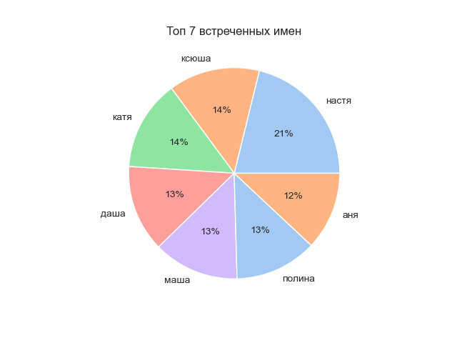

Сравние эту диаграмму с топ 7 лайкнутых и дизлайкнутых имён.

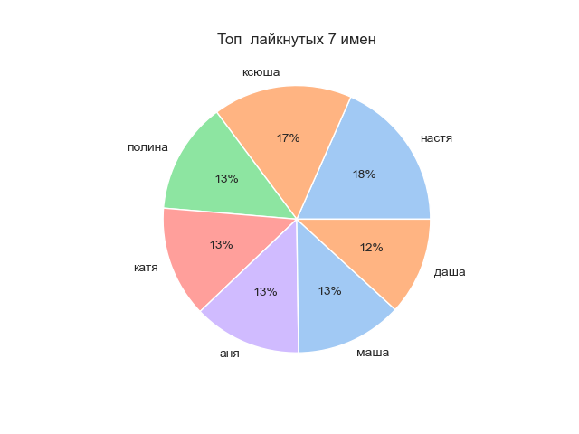

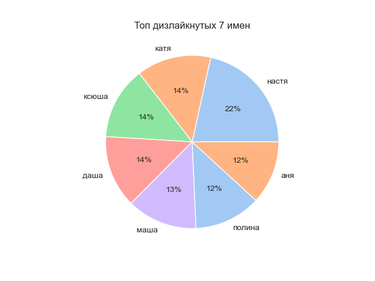

Видим, что имена повторяются. В лайкнутых и дизлайкнутых имена из списка общих частовстречаемых. Может показаться, что лайк/дизлайк не зависит от имени. 

Посмотрим на распределение имен по предпочтениям польователя (нравится, нормально, не нравится, неизвестное имя):

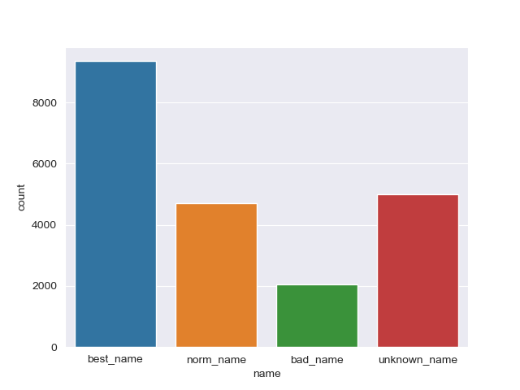

Делаем вывод, что имён, которые нравятся пользователю, очень много. Следоавтельно, действительно может быть, что имя мало влияет на результат

#### Статистика по бинарным признакам

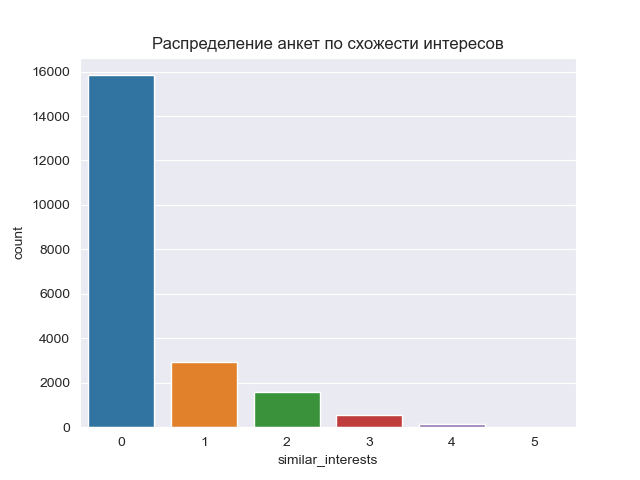

Видим, что больше всего анкет совсем без схожих интересов, однако с хоть каким-то их количеством тоже не так мало.

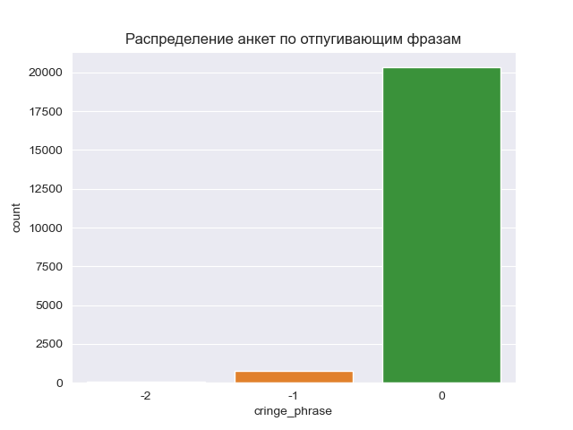

Видим, что анкет с пугающими фраами не так уж и много.

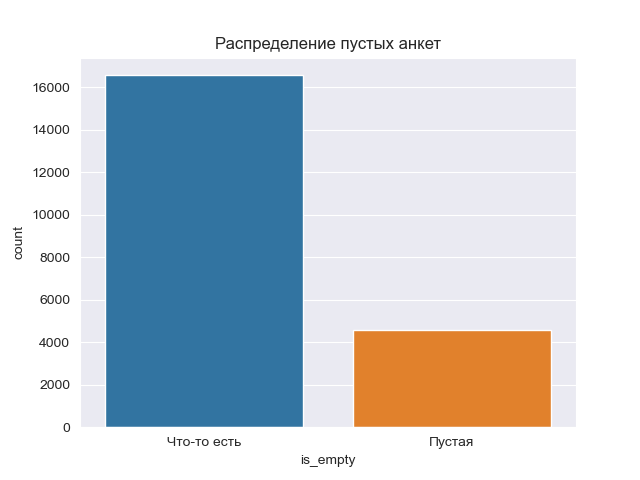

Видим, что из 22000 анкет примерно 5000 являются пустыми.

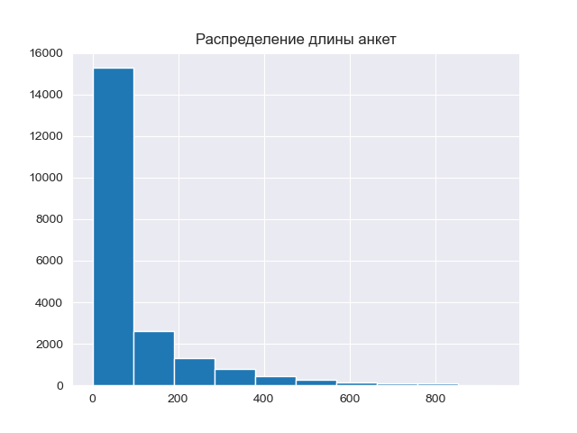

На гистограмме предствалено распределение анкет по длине сообщений

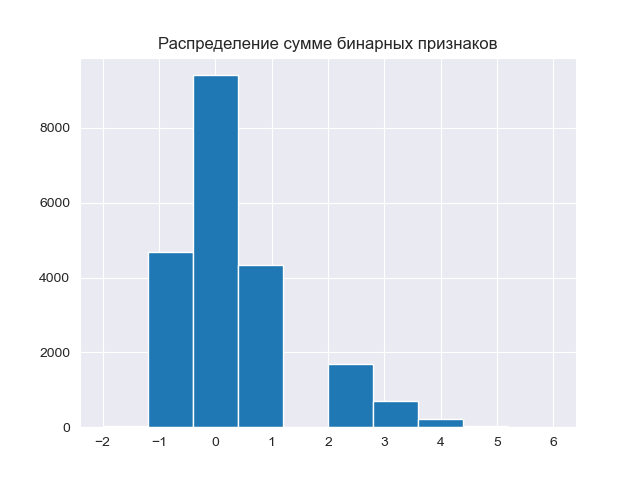

Данное распределение - сумма бинарных признаков. Есть признаки с отрицательными и положительными весами, которые каким-то образом могут влиять на реультат.

## Результаты тестирования модели:
Предположительно, очень сильно влияет фотография. На данный момент модель не учитывает фото, поэтому результат, возможно, будет плохим.

Из-за того, что фото может влиять огромного значение, в данных с уже сконструированными присутствует очень много выбросов. (лайков, основанных, например, только на внешности)

(Позже мы увидим, что действительно выбросы очень сильно ухудшают модель. Выделенных на текущий момент признаков недостаточно для того, чтобы с нужной точностью спрогнозировать поведение пользователя)
### Результаты без учета фотографии:
В итоге были удалены такие признаки, как ```inst```, ```distance_to```, ```name```.

Отобразим важность признаков для каждой модели:

**Random Forest:**

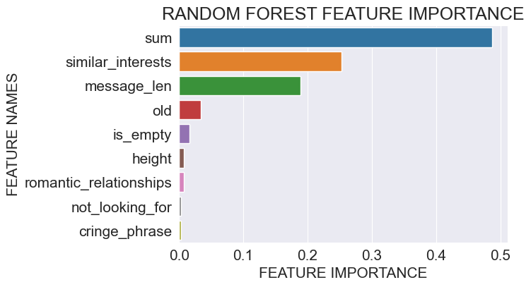
Видим, что для модели Случайного леса признак ```sum```, означающий сумму всех бинарных признаков.  Как и ожидалось, оказывает самое сильное влияние. 

На втором месте признак ```длина сообщения```. Действительно, иногда читать длинные сообщения может быть утомительно. 

Далее идёт ```количество схожих интересов```. Это точно так же отражает действительность.


**XGBoost:**

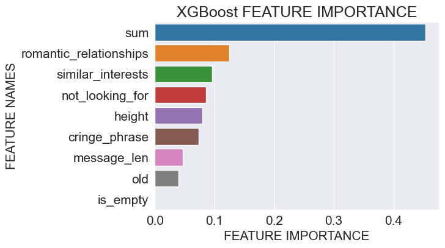

У XGBoost модели на первом месте, точно так же, параметр ```sum```.

Далее уже идут расхождения:

На втором месте прознак ```ищет ли девушка романтические отношение```. В целом это очень реалистично, т.к сразу понятны намерения девушки.

На третьем месте, как и у Случайного леса, ```количество схожих интересов```.

#### Результаты на валидации модели:


**Random Forest:**
|  |precision  |recall  |f1-score  |support  |
| --- | --- | --- | --- | --- |
|0  | 0.79 |0.95  |0.86  | 439 |
| 1 | 0.95 | 0.81  |  0.87 | 565 |
|macro avg  |  0.87 | 0.88   |  0.87  | 1004 |
|weighted avg  |  0.88 |  0.87  | 0.87  | 1004 |   

**XGBoost:**
|  |precision  |recall  |f1-score  |support  |
| --- | --- | --- | --- | --- |
|0  |  0.90 | 0.93 |0.88  | 439 |
| 1 |  0.90 | 0.93   |  0.91| 565 |
|macro avg  |  0.90 | 0.90  |  0.90 |  1004|
|weighted avg  | 0.90  |  0.90 | 0.90  | 1004 |

Видно, что на обучающей выборке модели ведут себя достаточно хорошо, однако так ли это на самом деле?

#### Результаты на тестировании модели:
Проведем эксперимент:
- были пролайканы несколько анкет (~300 штук) в режиме реального времени
- будет применена модель для сравнения с "реальной" ситуацией

**Random Forest:**
|  |precision  |recall  |f1-score  |support  |
| --- | --- | --- | --- | --- |
|0  |0.89  | 0.51 |0.65  | 223 |
| 1 | 0.14  | 0.56 |0.23  |   32|
|macro avg  |  0.52|  0.54| 0.44  |   255|
|weighted avg  |  0.80 |0.52  | 0.60   |  255 |

Из таблицы можно сказать следующее:

Модель с вероятностью ~50% дает правильный ответ. Она правильно поставила половину лайков и половину дилайков. Вспоминая признаки понятно, что это более-менее реалистично.

Взвешанный f1-score = 0.60, т.е модели можно доверять на 60 %.

В целом неплохой результат для исключительно текстовых признаков без особого nlp.

**XGBoost:**
|  |precision  |recall  |f1-score  |support  |
| --- | --- | --- | --- | --- |
|0  | 0.84 |0.22  | 0.35  | 223 |
| 1 |0.12   |0.72  |  0.20  | 32 |
|macro avg  | 0.48  |0.47  |0.27  |  255|
|weighted avg  |0.75   | 0.28   | 0.33   | 255 |

XGBoost же отрабатывает гораздо хуже, чем Random Forest по средней оценке, но тут тоже есть свои плюсы:

recall-score = 0.72 для класса ```лайк```. Это значит, что модель правильно лайкнула 72 % анкет.

По дизлайкам же все гораздо хуже: модель правильно дизлайкнула всего 22 % анкет.

Из-за того, что модель научилась хорошо определять лишь анкеты, которым нужно поставить лайк, ввешанный f1-score очень маленький.
Взвешанный f1-score = 0.33, т.е модели можно доверять на 33 %. (Однако на 72 % в случае лайков)

##### Идея: как получить результат чуть получше?
Если вспомнить топ 3 важный признаков для каждой модели и объединить их вместе, то получится вполне реалистичная с точки зрения логики модель:
1. Взвешивает плюсы и минусы анкеты
2. Смотрит на количество схожих интересов
3. Смотрит на то, ищет ли девушка романтические отношения

В целом, если убрать и сервиса для знакомств фотографии, то примерно так и оценивались бы анкеты.

Исходя из этих соображений появляется идея использовать ```ансамбль моделей для прогнозирования```

# Идеи на будущее:
1. Добавить nlp. Выделить что-то общее из лайкнутых сообщений и считать для каждой анкеты косинусное расстояние.
2. Учитывать фотографии из анкеты (обучить нейронную сеть, которая предполагает вероятность лайка/дилайка по фото)
3. Попробовать другие модели: kNN, BernoulliNB
4. Ансамбль моделей для прогнозирования


